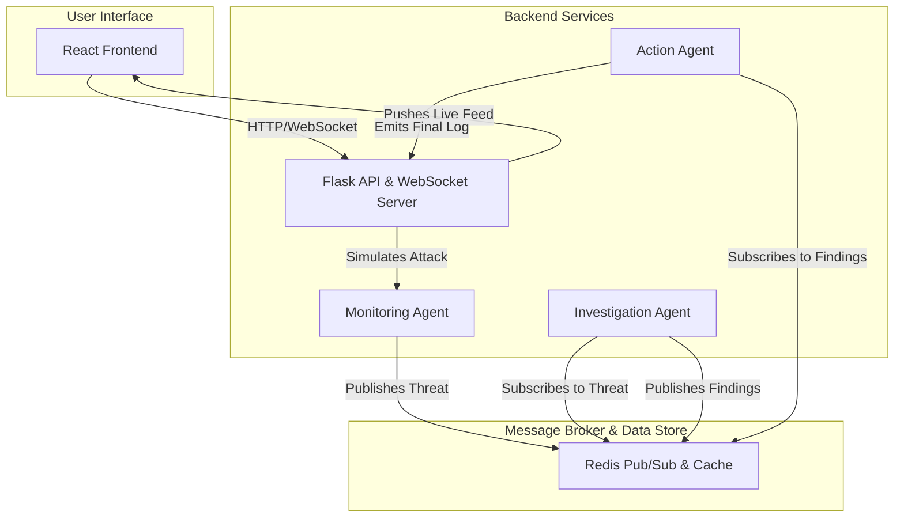

# Agentic AI System for Autonomous Threat Response


A proof-of-concept **autonomous cybersecurity system** that uses a team of specialized AI agents to automatically detect, investigate, and neutralize network threats in real-time. This project demonstrates how **Agentic AI** can be used to combat alert fatigue and dramatically accelerate incident response times.

---
## ✨ Core Concepts

This system is built on two foundational concepts: **Agentic AI** and the **Model-Context-Protocol (MCP) framework**.

### Agentic AI
Instead of a single, monolithic model, this project uses a multi-agent system. Each **agent** is an autonomous AI program with a highly specialized role. They collaborate to achieve a complex goal—defending the network—that would be difficult for a single agent to manage. This approach promotes modularity, scalability, and specialization.

### Model-Context-Protocol (MCP) Framework
Each agent is designed using the MCP pattern to clearly define its function:
* **Model**: The agent's "brain" or reasoning engine.
* **Context**: The specific data the agent operates on.
* **Protocol**: How the agent communicates with other systems.

Our system is composed of three distinct agents:

#### 1. Monitoring Agent
* **Model**: A **rule-based anomaly detection model** that uses signature matching (e.g., searching for `' OR 1=1` in payloads) and threshold analysis (e.g., flagging an abnormally high number of requests from one IP).
* **Context**: Real-time (simulated) network traffic data.
* **Protocol**: Publishes threat alerts as structured JSON messages to a Redis channel (`threat_channel`).

#### 2. Investigation Agent
* **Model**: A pre-trained **Large Language Model (`distilgpt2`)**. It uses its natural language understanding to analyze the threat type and generate a human-readable countermeasure based on its vast training data.
* **Context**: The threat alert data received from the Monitoring Agent.
* **Protocol**: Subscribes to `threat_channel` for alerts and publishes its findings to the `action_channel`.

#### 3. Action Agent
* **Model**: A deterministic, **rule-based keyword parser**. It scans the LLM's recommendation for action verbs (e.g., "block," "terminate") to decide which predefined mitigation workflow to execute.
* **Context**: The full investigation report from the Investigation Agent.
* **Protocol**: Subscribes to `action_channel` for instructions and executes system-level actions, publishing the final results to the UI via WebSockets.

---

## 🏛️ System Architecture

The application is a containerized, event-driven microservices architecture designed for real-time performance and scalability.



### End-to-End Workflow
1.  **Simulation**: A user initiates an attack from the **React Frontend**.
2.  **Detection**: The **Monitoring Agent** detects the anomaly and publishes a threat alert to **Redis**.
3.  **Investigation**: The **Investigation Agent** picks up the alert, uses its **LLM** to analyze it, and publishes a recommended action.
4.  **Action**: The **Action Agent** receives the recommendation, executes the countermeasure, and logs the final result.
5.  **Visualization**: Throughout the process, each agent sends status updates to the **Flask WebSocket Server**, which instantly pushes them to the **React Frontend** for the user to see in the live feed.

---

## 🛠️ Technology Stack

| Category           | Technology                                                              |
| ------------------ | ----------------------------------------------------------------------- |
| **Frontend** | React, Socket.IO Client, Tailwind CSS                                   |
| **Backend** | Python, Flask, Flask-SocketIO, Gunicorn, Eventlet                       |
| **AI/ML** | Hugging Face Transformers (`distilgpt2`)                                |
| **Database/Broker**| Redis                                                                   |
| **DevOps** | Docker, Docker Compose, Nginx                                           |

---

## 🚀 Getting Started

You can run the entire application locally using Docker.

### Prerequisites
* [Docker](https://www.docker.com/products/docker-desktop/) and Docker Compose
* [Git](https://git-scm.com/)

### How to Run Locally
1.  **Clone the repository:**
    ```bash
    git clone [https://github.com/YOUR_USERNAME/agentic-cybersecurity.git](https://github.com/YOUR_USERNAME/agentic-cybersecurity.git)
    cd agentic-cybersecurity
    ```
2.  **Build and run the containers:**
    This command will build the Docker images for the frontend and backend, and start all three services.
    ```bash
    docker-compose up --build
    ```
3.  **Access the application:**
   * **Frontend Dashboard:** [http://localhost:3000](http://localhost:3000)
   * **Backend API (for testing):** [http://localhost:5000](http://localhost:5000)

---

## 📁 Project Structure
```
/agentic-cybersecurity
|
|-- backend/
|   |-- agents/             # Contains the logic for each AI agent
|   |-- app.py              # Flask server, API endpoints, and WebSocket handlers
|   |-- Dockerfile
|   |-- requirements.txt
|
|-- frontend/
|   |-- src/
|   |   |-- App.js          # The main React component
|   |-- Dockerfile
|   |-- nginx.conf          # Nginx configuration for serving the React app
|   |-- package.json
|
|-- docker-compose.yml      # Orchestrates all the services
|-- Readme.md               # You are here!
```

---

## 🌱 Future Improvements

This project serves as a strong foundation. Future enhancements could include:
* **Real Network Integration**: Connect the Monitoring Agent to a real network interface using tools like Scapy or by parsing logs from Suricata/Zeek.
* **Human-in-the-Loop**: For high-severity threats, require a human analyst to approve the Action Agent's proposed countermeasure via the dashboard.
* **Model Fine-Tuning**: Fine-tune the Investigation Agent's LLM on internal security documents and incident reports to provide more context-aware and accurate recommendations.
* **Advanced Action Capabilities**: Expand the Action Agent's abilities to interact with cloud provider APIs (e.g., to isolate a VM in AWS/GCP) or enterprise security tools.

---

## 📄 License

This project is licensed under the MIT License. See the `LICENSE` file for details.
